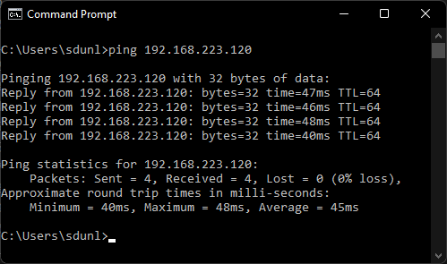
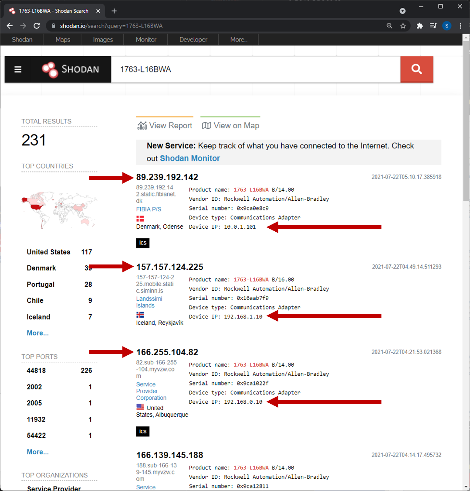
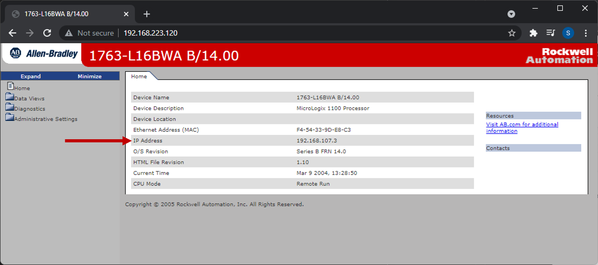

# Your IP address

**Each breakout room (BR) has their own HILICS kit. Only connect to the IP address of your kit; do not connect to any other teams' kits.**

* The subnet is 192.168.223.0\24. Your specific HILICS kit IP is (100 + BR number). For example, the IP address for BR 20 is:

```
192.168.223.120
```

* To repeat, your IP address is:

```
192.168.223.[100 plus your breakout room number]
```


# Instructions 

Make sure you are connected to the VPN and verify that you can reach your HILICS IP address using ping:

```
ping 192.168.223.1XX
```

<div align="center">

</div><br/>


# Shodan

One very common method for enabling remote access to a PLC is to use port-forwarding through a NATed router. You can tell this by looking at the public IP address and comparing it to the PLC's configured IP address. HILICS is configured to mimic this setup.


<div align="center">

</div><br/>

<div align="center">

</div><br/>

If you find a PLC on Shodan, you can usually pull up the web interface to see more details.

**Note: Searching for devices on Shodan is perfectly safe, but do NOT directly visit any of the devices you find. Legality in this area is very fuzzy... don't go to jail.**

<div align="center">

</div><br/>


