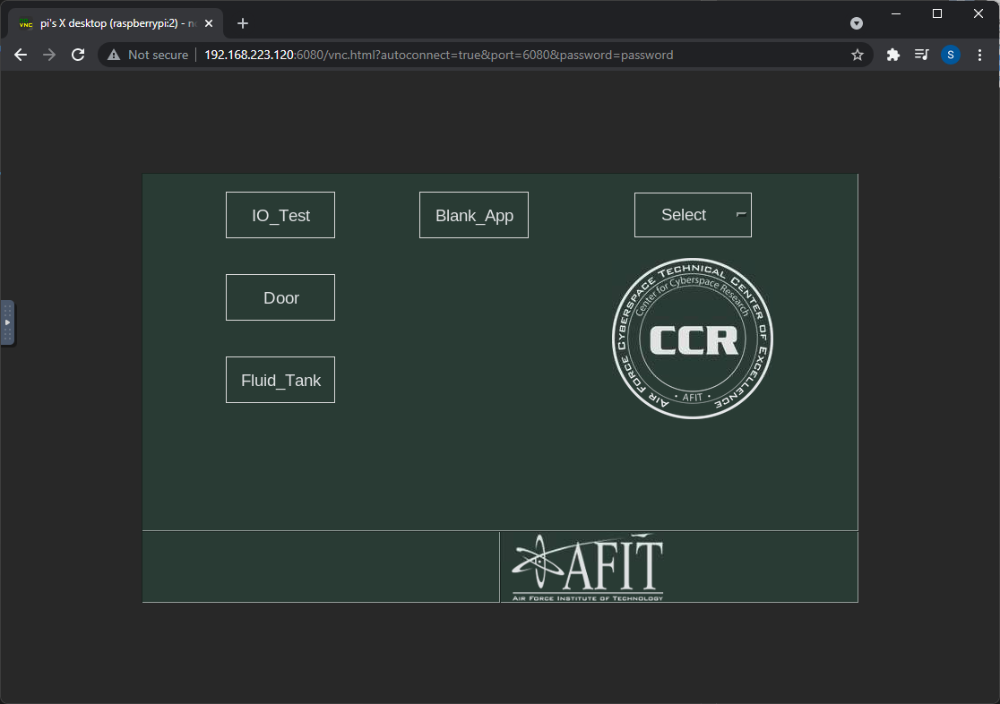
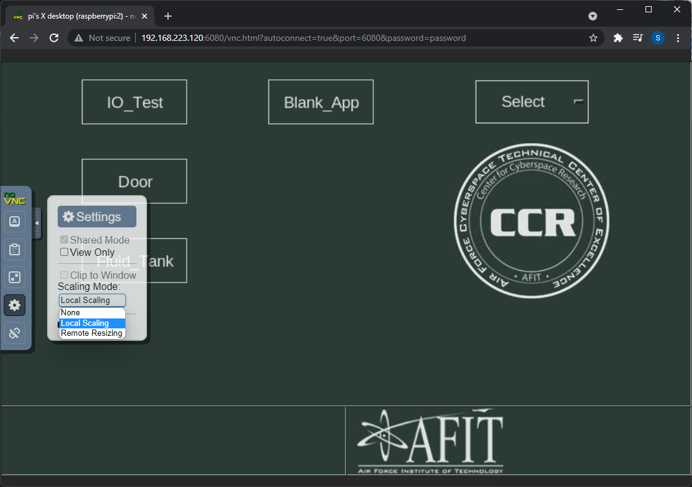
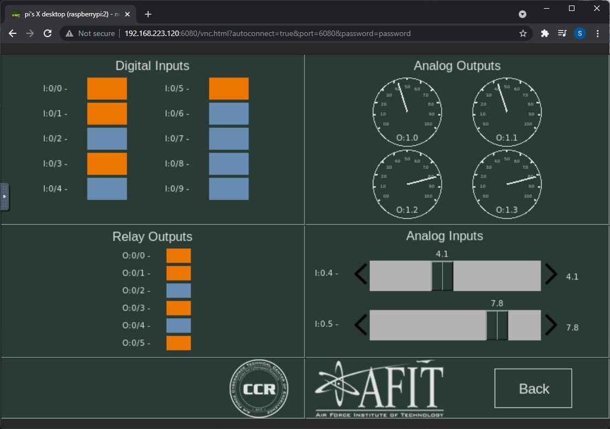
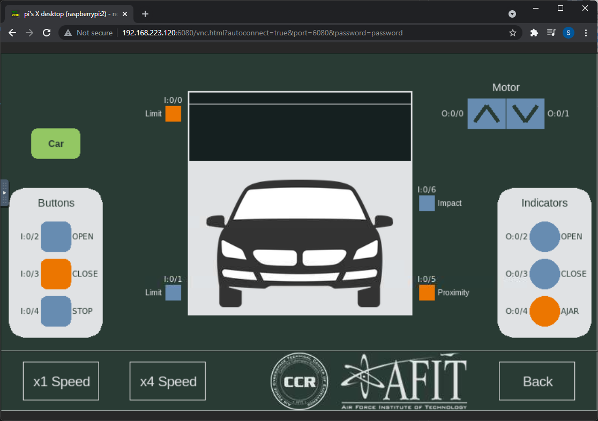
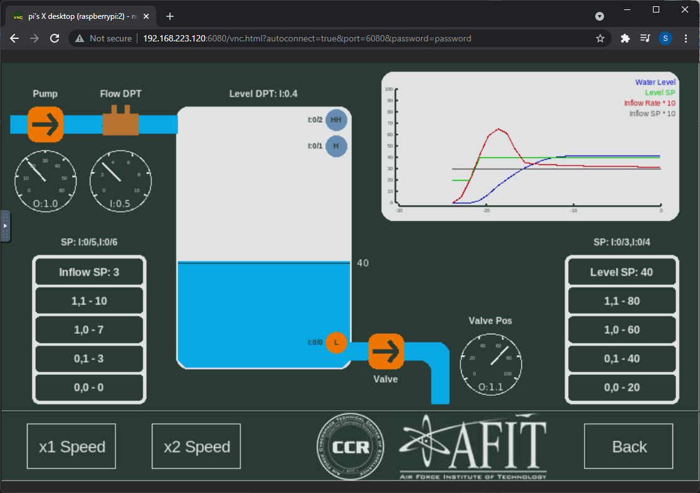

# VNC connection

Use the following URL to access the simulation for your HILICS kit (substitute your IP in place of XX). 

```
http://192.168.223.1XX:6080/vnc.html?autoconnect=true&port=6080&password=password
```

When you get connected you should see this view (it may take some time to connect).

<div align="center">

</div><br/>

If you prefer, you can change the scaling to local to go full screen.

<div align="center">

</div><br/>


# Simulations

HILICS contains a few different hardware-in-the-loop simulations. You can click on one of the buttons to select the application. Once in an application, you can select "Back" to go back to the main selection.

## IO Test

This application allows you to control all of the PLC inputs and see the state of all of the PLC outputs. The default ladder logic on the PLC simply mirrors the inputs to the outputs. Typically, this application is used to verify that everything is working correctly; however, you can also use this to experiment and learn how the engineering software works. 

<div align="center">

</div><br/>


## Garage door simulation

This simulation represents a basic garage door control system. While this is a simple door for allowing cars through, it could also represent an industrial loading bay or even an aircraft hanger. This simulation has various digital sensors and actuators and is used to teach an introduction to ladder logic programming.  

For more information about the simulation, read this document (**Note: you do not need to follow the instructions at the end**)

https://github.com/sdunlap-afit/hilics/blob/master/labs/L2_Door_Control.md

Today, you will use the proprietary engineering software to disable the software-controlled safety feature that prevents the door from crashing down onto a passing car. Then you will modify the controller's code to make it automatically crash the door into a passing car. 

<div align="center">

</div><br/>

## Fluid tank simulation

This simulation represents a tank with a pump to control the inflow rate into the tank and a valve to control the level of fluid in the tank. This simulation uses analog sensors and actuators and is used to teach analog control and PID tuning. 

For more information about the simulation, read this document (**Note: you do not need to follow the instructions at the end**)

https://github.com/sdunlap-afit/hilics/blob/master/labs/L3_Tank_Control.md


Today, you will use the engineering software to manipulate the water level in the tank and cause the pump to oscillate wildly. 

<div align="center">

</div><br/>
