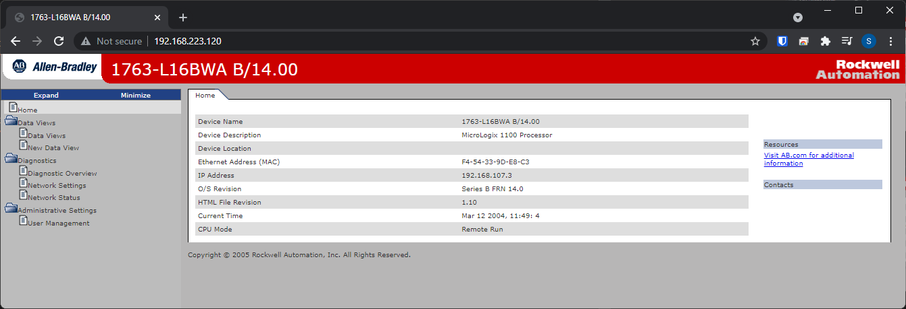
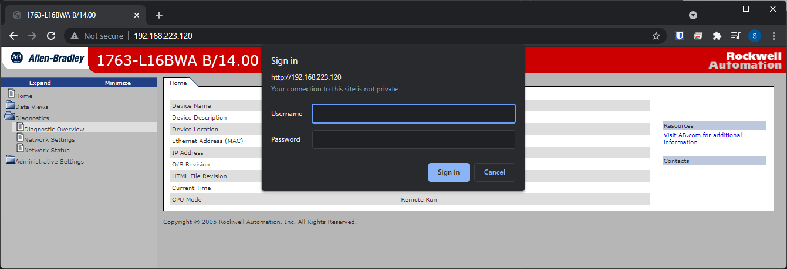

# PLC's web interface

The MicroLogix 1100 has a fairly minimal web interface with mostly read-only data. Some PLCs have much more control through the web interface (e.g., firmware updates, project file updates, control data modification).

<div align="center">

</div><br/>


If you click through the tabs on the left, you will be prompted for a password. I recommend Googling:

```
MicroLogix 1100 default password
```

You would be surprised how many PLCs still have the default password.


<div align="center">

</div><br/>


