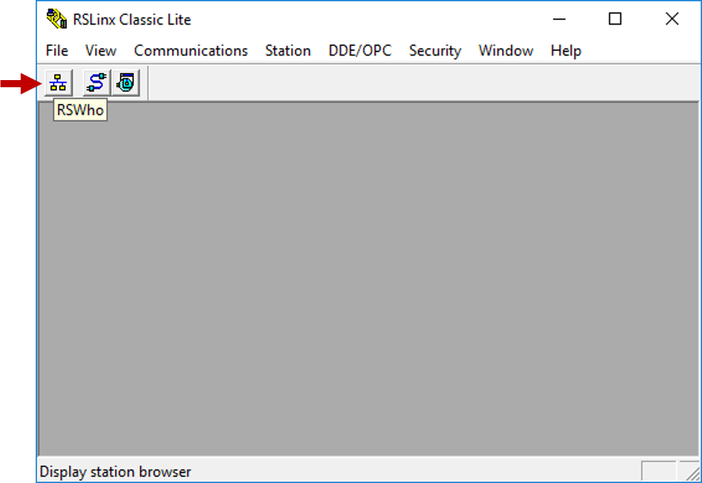
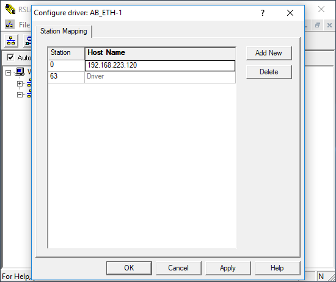
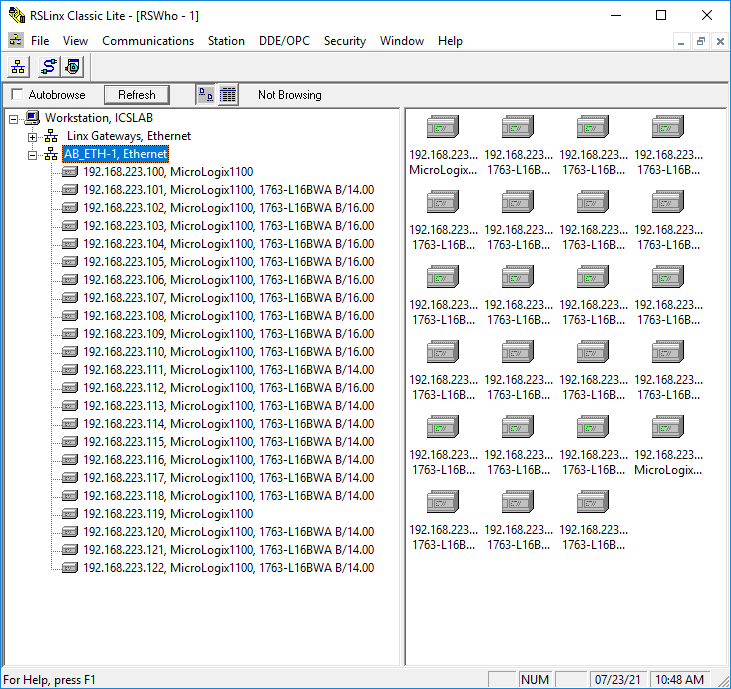

# RSLinx setup

RSLinx is proprietary software that acts as a communications gateway for PLCs. The programming software (RSLogix 500 in our case) uses RSLinx to access individual PLCs, so you have to configure RSLinx first. Once it is configured, simply leave it running in the background.

# Instructions

1. Select "RSLinx Classic" from the Windows start menu.

 

2. Once it loads, click on the "RSWho" button, and you should see two drivers under "Workstation". Right-click on the AB_ETH driver and select "Configure Driver".

  

  

3. Enter your IP address into a Station and click "OK".

 

4. Wait. RSLinx will automatically scan your IP address and will show the device info. This takes a little while. Make sure "Autobrowse" is selected.

 

5. If you waited a couple minutes and RSLinx still fails to connect, let me know via Zoom and I can take a look. I will be monitoring all the PLCs, so I should see if one goes offline. We do have backups, so if one kit fails, I can assign you another kit.

 

