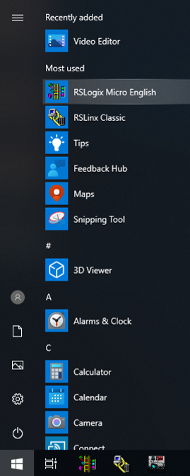
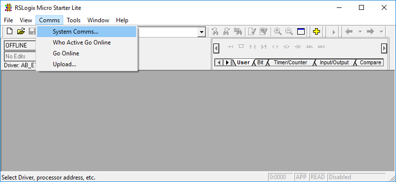
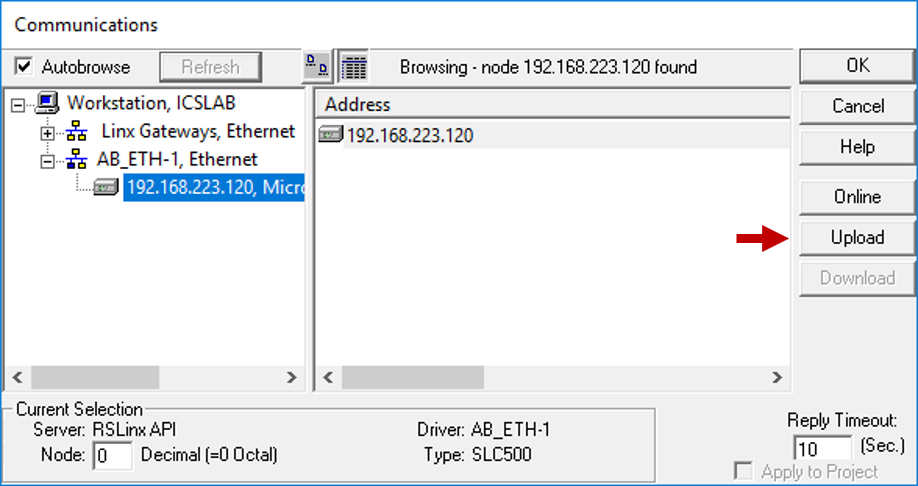
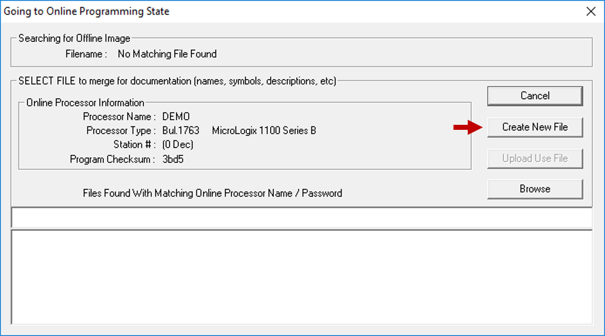
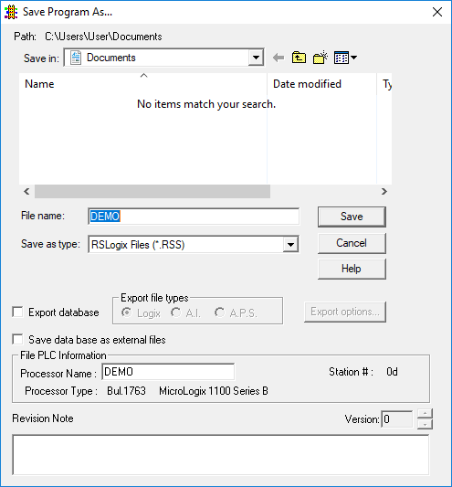
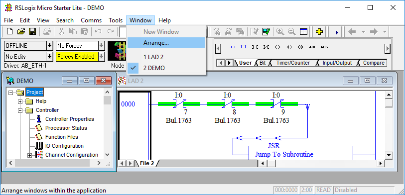
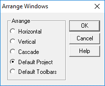

# How to retrieve a project from a PLC

Most PLCs have a feature to allow an engineer to retrieve the project file currently running on the PLC. This is useful for engineers to verify the code running on the PLC and to recover the file in case the original got deleted (it happens). While this does retrieve the original source code, to conserve the PLC memory resources, the file will lack any comments and variable names from the original file (this information is not stored on the PLC). This makes reverse engineering more difficult, so finding the original file on a computer/server is still desireable. 

# Instructions

1. Select "RSLogix Micro English" from the Windows start menu.

 

2. Since you don't know what is currently running on the PLC, you need to do an Upload to retrieve the current project file. Select "Comms -> System Comms..." from the menu. This opens the Communications window which will connect to RSLinx to find your device(s).

 

3. If you don't see your IP address under the AB_ETH driver, [make sure you configured RSLinx correctly](./04_rslinx.md) and make sure RSLinx is running. You should see this view. 

 

4. Select your IP address on the left and look at which options are available on the right. Since you don't have a project file open, "Download" is not available. Select "Upload". This will allow you to retrieve the project file that is currently loaded on the PLC.

 

5. Select "Create New File"

 

6. Once it finishes, you can "Go Online" if you like, or just click "No". Then, you can save the project file to your machine. Give it a name or use the default. The default options are fine.

 

7. **Save a backup of the original project file in case you need to revert.**

8. At this point, you should have the project file open and it should look something like this:

 

# Important tip

If you resize the RSLogix window, the view will look terrible. You can fix this by selecting "Window -> Arrange...". Leave "Default Project" selected and click "OK". 

If you mess up your toolbars, you can fix it using the "Default Toolbars" option.

  

  