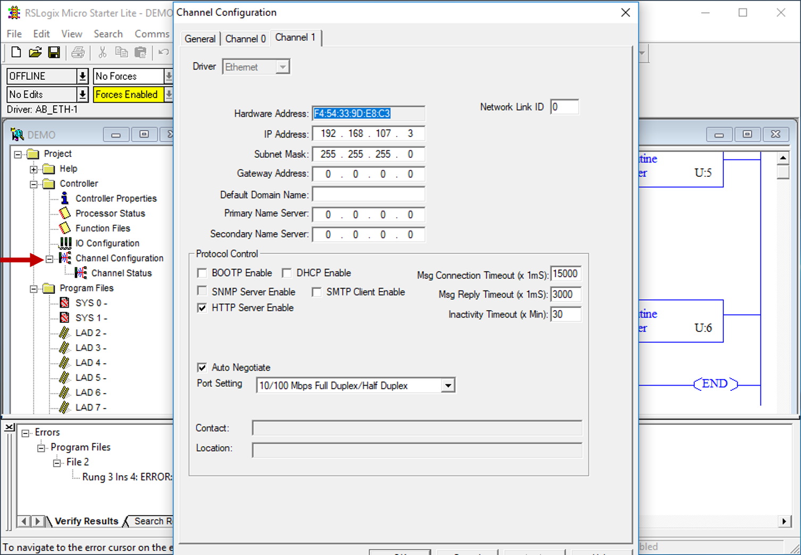
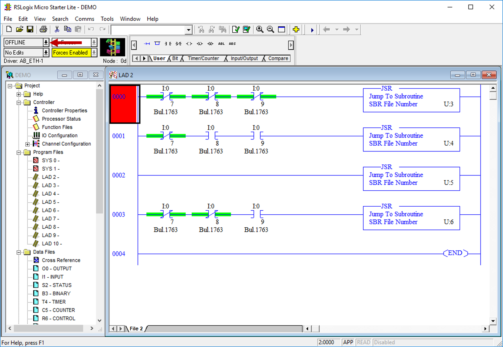
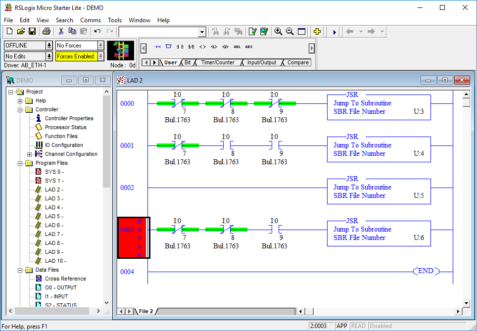
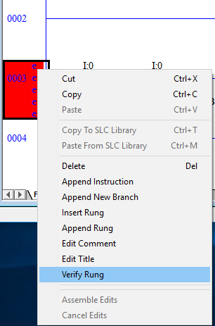
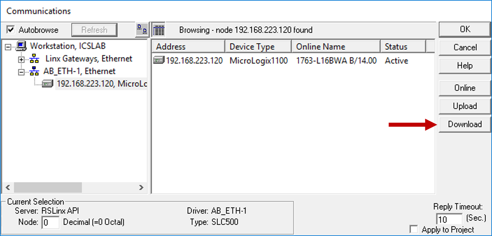
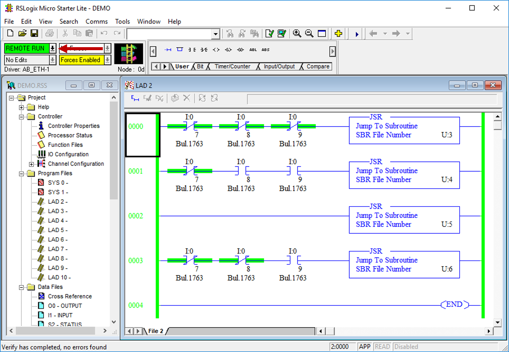

# How to program a PLC

**If you haven't already, [Upload the PLC's current project file from the PLC to your computer](./06_upload.md) and save the file.**

**You should always use one of the project files from this class. If you decide to start with a blank project file, you MUST configure the network to match these settings, otherwise you might lose access to the PLC. If you stick with project files from the PLC or files from the [HILICS github](https://github.com/sdunlap-afit/hilics), you should not need to change these settings. It is still worth checking these settings before you Download.**

 

# Instructions

1. You should have the project file open and be Offline. If you are not Offline, simply select the arrow next to this dropdown box and click "Go Offline".

 

2. If you made changes to the file, any modified rung will have e's next to it. You can right-click on the rung (red box in this picture) and select "Verify Rung". If there are no errors, this will clear the e's and you can Download. You can also select "Edit -> Verify Project" from the menu to verify the entire project at once. If there are any errors, they will be displayed at the bottom of the window and the e's will remain. I recommend verifying rungs as you go to make sure you don't have errors.

  

  

3. When you're ready, open "Comms -> System Comms..." from the menu. Then, select your PLC and click "Download".

 

4. You will get an annoying number of pop-ups throughout this procedure. You should be able to click "Yes" for all of them. 

    If all goes well, you should end up with this view. If you end up in "REMOTE PROG" mode, select the arrow next to the dropdown and select "Run" to change it to "REMOTE RUN" mode.

 