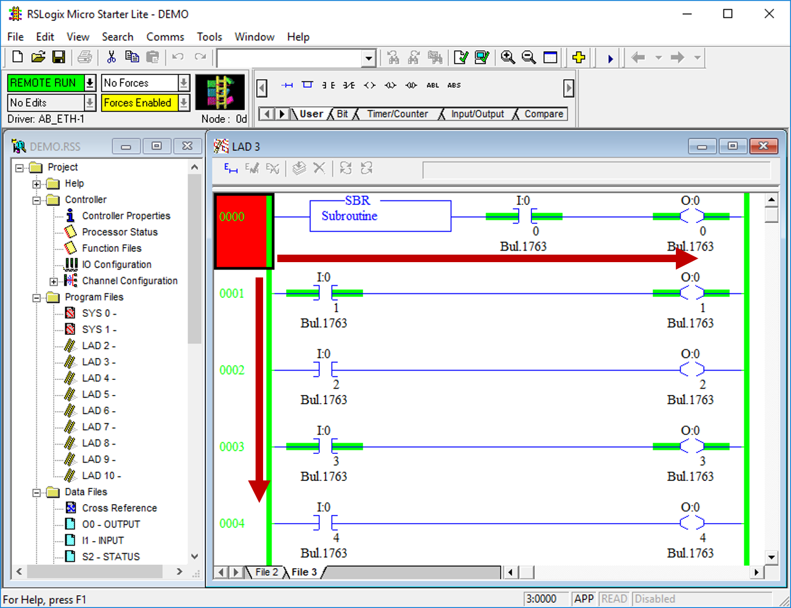
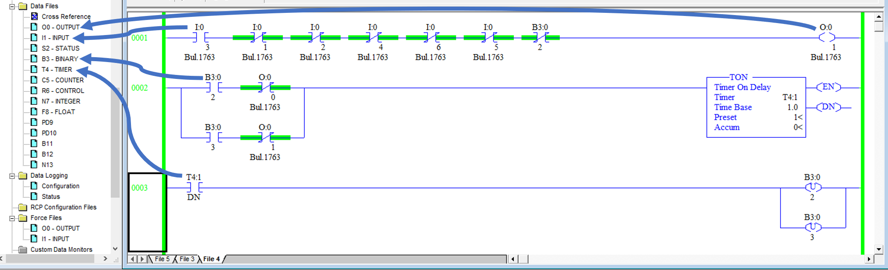
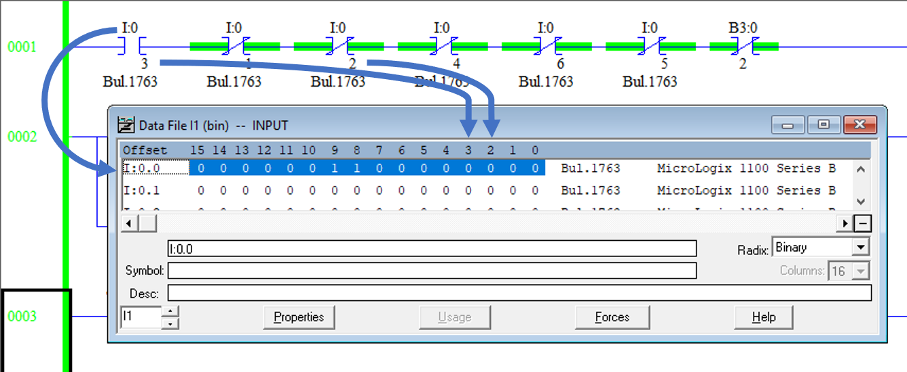
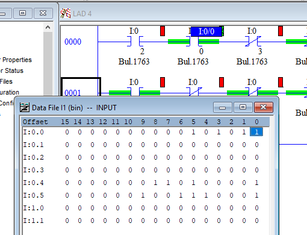
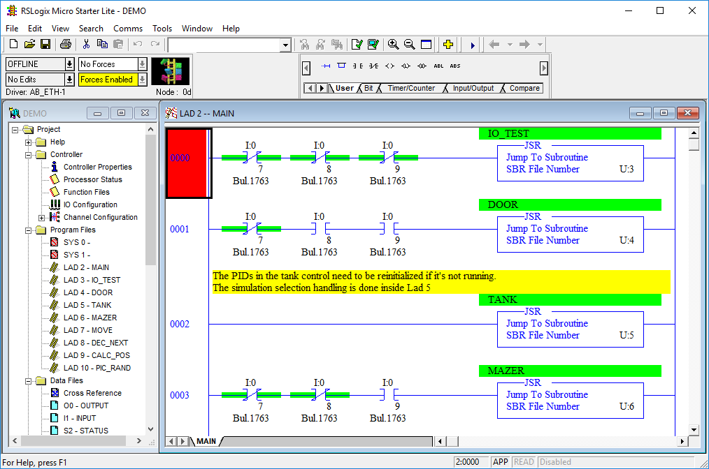
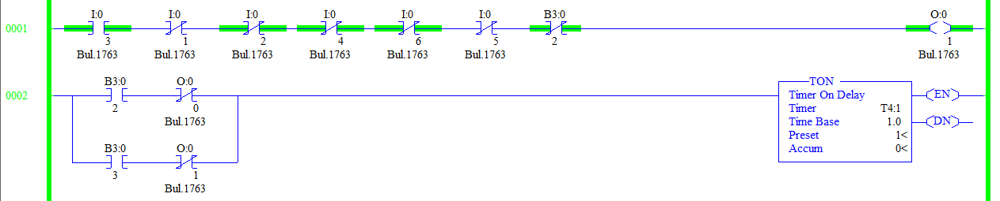
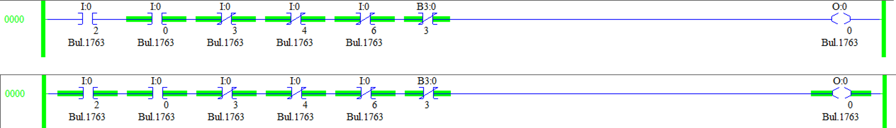
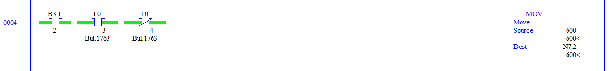

# Intro to Ladder Logic

There are various programming languages supported by PLCs. Structured Text is a text-based language similar to C. Function block diagrams is a visual language similar to LabView. One of the older and more popular languages (and the only language the MicroLogix 1100 supports) is called Ladder Logic.

If you come from a software background and are used to C++ and Python, you will HATE Ladder Logic. If you have a background in digital logic design (AND gates, OR gates, etc.) or in FPGAs, then this won't be so bad for you. 

PLCs are intended to run without any pauses or interruptions in execution (i.e., no sleep or blocking commands). For example, if your PLC is controlling cooling rods for a nuclear reactor, you don't want your PLC to stop running while it waits for a network packet to arrive; it just keeps executing.

Whenever the main subroutine (LAD 2) finishes, it simply starts over from the beginning. In other words, the main Ladder is in an infinite loop and is intended to execute with 100% uptime (24/7) without interruption.

While, behind the scenes, the code does execute in order (left-to-right then top-to-bottom), external inputs can change asynchronously. It is best to think about ladder logic the same way you think about gate logic - everything happens in parallel at the same time.

<div align="center">

</div><br/>

A Ladder Logic program is made up of Ladders, which are made up of Rungs. For this PLC, variables are stored in files and referenced by address (more modern PLCs use "Tag names" instead).


## Data Files (Variables)

RSLogix 500 uses data files for storing variables. Each file has a type (Input, Output, Binary, Integer, etc.) and a number. So, to reference the B3 - BINARY file, you would use address B3:XXXX. 


<div align="center">

</div><br/>


The first number after the ':' represents the row in the data file. So, I1:0 (or just I:0) is the first row. This file/row is read-only and contains the values of the digital inputs for the PLC. O0:0 (or just O:0) is controlled by you and determines the value of the digital outputs. The rest of the data files are mostly read/write.

For bits (binary values) the number after the slash '/' (e.g., I:0/3) is the bit in the row.

<div align="center">

</div><br/>

**TIP: If you select an element and then click and drag it, bubbles will show up in places you can drop it. This is an easy way to assign addresses to operations. You can also drag from one operation to another.**

<div align="center">

</div><br/>

**TIP: In the various simulations, the addresses for the Inputs and Outputs are shown next to the buttons/indicators.**

<div align="center">

</div><br/>


## Ladders

You can think of Ladders as subroutines or functions. Each Ladder is contained in its own file and you can execute Ladders by using a "JSR" (Jump to Subroutine) instruction. The project loaded onto your PLC is a demo project written to control all three of the simulated systems. The Raspberry Pi uses three digital signals (PLC digital inputs I:0/7, I:0/8 and I:0/9) to tell the PLC which simulation is running. Based on the state of these three inputs, the PLC calls the appropriate subroutine for the given simulation.

**HINT: This screenshot is from the original project file and has the various comments and variable names. Use this to help figure out how the code works.**

<div align="center">

</div><br/>


## Rungs

A Ladder is made up of Rungs. Rungs execute from left to right. You can kind of think of a rung as a circuit. The rung starts out as High/True/Green on the left and that value flows from left to right. As the value hits the various operations, the current value of the rung is ANDed with the result of the operation. If there is a branch, the value has two paths to flow through, so it acts as an OR operation. 

* Green - logic high or true
* Left side of rung - Input operations
* Right side of rung - Output or result of rung
* Series operations - AND logic
* Branch or parallel - OR logic
* Examine if Closed (e.g., I:0/3) - if I:0/3 is High, then the operation is High
* Examine if Open (e.g., I:0/1) - NOT gate. If I:0/1 is Low, then operation is High

<div align="center">

</div><br/>


If the rung is still High after it gets through all the logic, then the output on the right side will execute. 


For an Output Energize operation, the value of the output will reflect the resulting value of the rung. in pseudocode:
```
boolean output = input1 AND input2....
```

<div align="center">

</div><br/>

Most other operations will either happen or not-happen depending on the inputs. This includes math operations, move, latch, unlatch, etc. If the input logic results in a low, then nothing will change.

<div align="center">

</div><br/>
