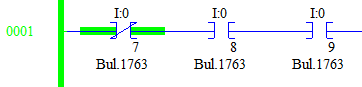

# Going Online

It is very difficult to debug code that you can't inspect. Most IDEs have a way to set breakpoints, inspect variables and single step through code. PLCs have similar features; however, PLC code is intended to execute in real-time, so breakpoints and single-stepping are typically not supported. 

In Online mode, the user can see the state of all variables and operations. Green surrounding an operation means that the operation (not the variable) in currently evaluating as High/True. In this image, I:0/7 is Low, so the "Examine if Open" operation is High.

 

### NOTE: If the logic does not match what you expect, make sure the subroutine you're looking at is actually running. LAD 2 contains the logic that determines which subroutine is running depending on which simulation the Raspberry Pi is running.

# Instructions

To go into Online mode, the project file on the PLC must match the project file in RSLogix. The easiest way to go online is to do a [Download](./07_download.md) or [Upload](./06_upload.md) and select "Yes" when it asks if you want to go Online.

Online mode has many interesting features. Try right-clicking on some operations and play around with some of the options such as "Toggle Bit" or "Force".