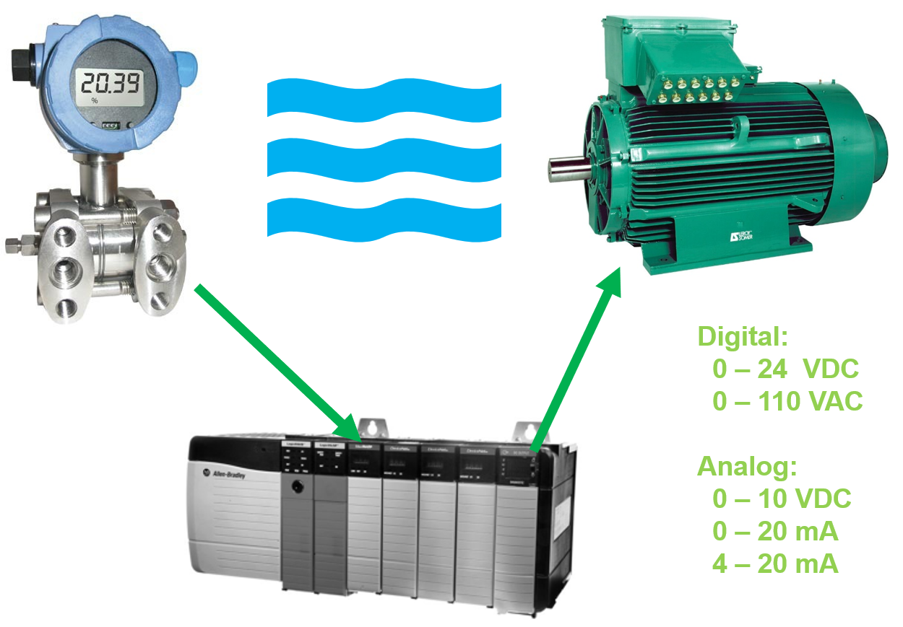
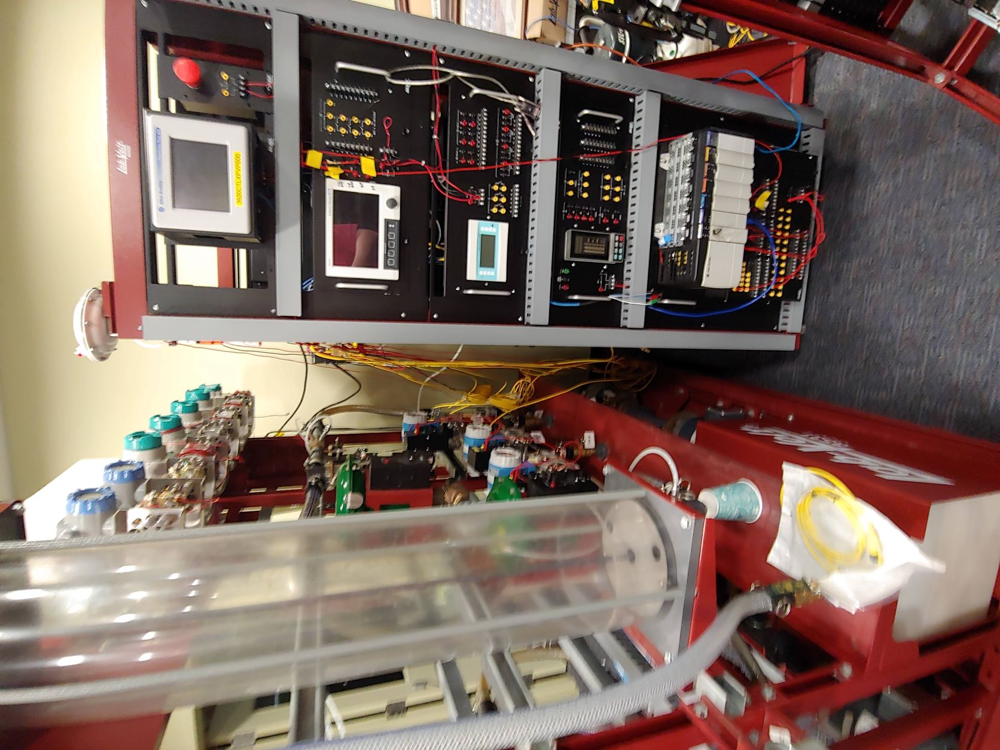
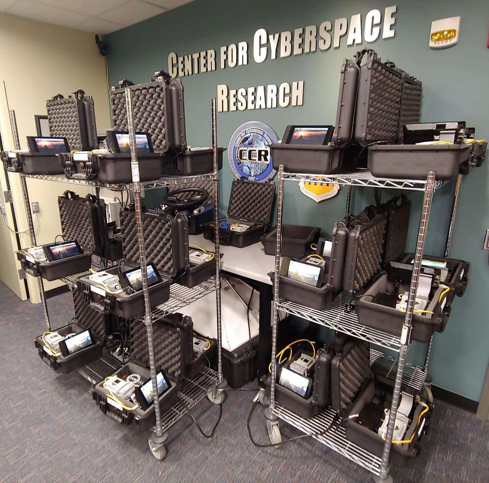
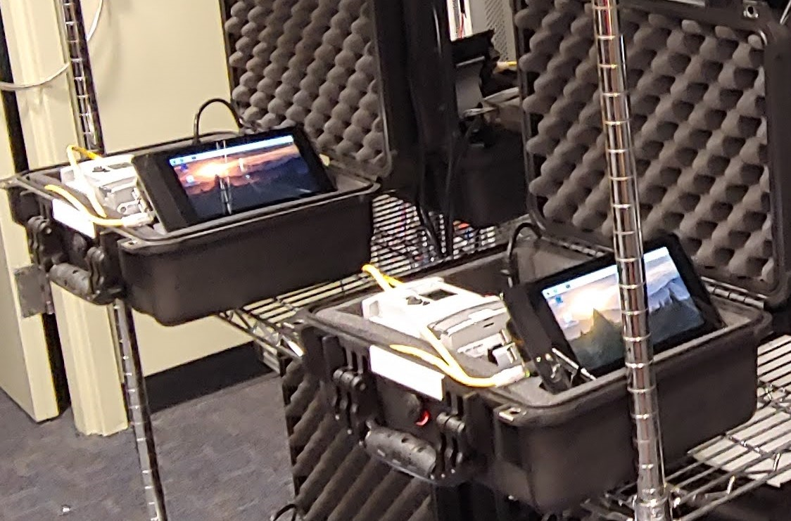

  

  

# ACE 2021 - Industrial Control Systems

## Introduction

Welcome to ICS security. Today you will explore a programmable logic controller that is controlling two simulated processes. The equipment you will be working with is representative of control devices you might find as part of a larger control system network. You will learn how to explore unknown control devices, configure proprietary software to interface with the controller, and use your access to manipulate the processes. In a real-world scenario, an adversary's attack will depend on their desired effect (e.g., equipment damage, process manipulation, etc.). 

## Schedule

	0830 - 0930:	Discussion
	0930 - 1130:	Intro/demo/Lab
	1130 - 1230:	Lunch
	1230 - 1330:	Discussion and/or questions
	1330 - 1530:	Lab time

## Outline

* Discussion
* Shodan demo
* HILICS Setup
* Exercises 1-3
* Lunch
* Q&A
* Discussion
* Exercise 4
	* Register Session
	* Request Identity
	* Forces
* Wrap up

## Cyber-physical Systems

Cyber-physical systems are computer-based systems designed to control physical processes. Self-driving cars are excellent examples of cyber-physical systems. In my opinion, the most likely areas of cyber-physical systems you may get into during your military career (both offensive or defensive) are **industrial control systems and weapon systems.**

Process control typically involves:

* Sensors - devices that measure some aspect of their environment, such as temperature, pressure, acceleration, position, etc.
* Actuators - devices that act on their environment, such as motors, valves, heating elements, etc.
* Controllers - processors and peripherals that handle the intelligence behind the process control.

 

## Equipment

Industrial control systems contain a wide variety of equipment and processes. This picture shows an example of a simple water system training platform. This system is expensive, takes up a significant amount of space and requires compressed air and water tanks. Thus, it is infeasible to build multiple platforms, and one system cannot be shared amongst 50 students.

 

Now, we could just hook up multiple programmable logic controllers and let you go to town, but it would not be realistic or interesting unless there was a process to control. That's why we built the [hardware-in-the-loop](https://en.wikipedia.org/wiki/Hardware-in-the-loop_simulation) industrial control system (HILICS) training platform. For specifics on the system, check out the [HILICS github page](https://github.com/sdunlap-afit/hilics).

 

Each HILICS kit contains a MicroLogix 1100 programmable logic controller to act as the target for attack and defense. A Raspberry Pi simulates the physical process and feeds inputs/outputs to/from the programmable logic controller. As far as the MicroLogix knows, it is operating a full-fledged industrial control system.

 

You will be working in your prearranged groups in breakout rooms. Each group will have access to one HILICS kit, accessible through the GECO VPN. To enable this virtual interface, the Raspberry Pis have noVNC installed; you will use a browser to access the noVNC interface to view and operate the process simulations. You should not try to attack the Raspberry Pi's VNC interface. 

 

Each Raspberry Pi is directly connected to the MicroLogix 1100 via an Ethernet cable, and port-forwarding is used to route the necessary traffic through the Raspberry Pi to the MicroLogix. Thus, you will access both the VNC and the MicroLogix interfaces through the same IP address. This is representative of port-forwarding through a NATed router.

 

# Documentation and procedures

Read through the documentation in this order.

1. [Network Information](./01_network.md)

1. [Simulation Raspberry Pi vnc](./02_hilics_vnc.md)
1. [PLC's web interface](./03_web_interface.md)
1. [Setup RSLinx to connect to the PLC](./04_rslinx.md)
1. [RSLogix background](./05_rslogix.md)
1. [Retrieve the PLC's project file (Upload)](./06_upload.md)
1. [Program the PLC (Download)](./07_download.md)
1. [Intro to Ladder Logic](./08_ladder_logic.md)
1. [See the PLC operating live (Go Online)](./09_online.md)

# Exercises

I have four exercises planned for today. They will probably take longer than you have time for, so it's ok if you don't finish everything. I will leave the HILICS kits and this Github page up until ACE is over, so you can revisit this if you have some down time.

Feel free to complete them in any order; however, you may miss some useful information if you skip ahead. I recommend at least skimming them all first.

1. [Familiarization](./exercise1.md)

1. [Door simulation attacks](./exercise2.md)

1. [Fluid Tank simulation attacks](./exercise3.md)

1. [Custom exploit development](./exercise4.md)

