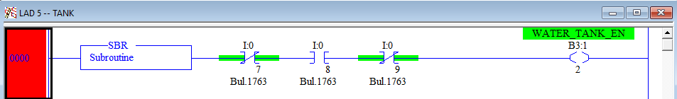
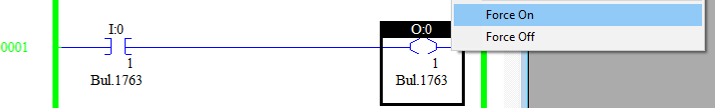

# Familiarization

The purpose of this exercise is to familiarize you with RSLogix and the Simulations. You will use Online Mode in RSLogix to see the Inputs and Outputs change as the Simulation changes.

## Instructions

1. Read through the documentation numbered 01-09. This information is necessary to complete the exercises.

1. If you haven't already, [retrieve the project file from your PLC](./06_upload.md) and [Go Online](./09_online.md).

    This screenshot shows the original source code, including comments and symbols. Use this as a reference as you explore the project file.

    

    
    
 

1. On the [Raspberry Pi](./02_hilics_vnc.md), select the IO Test application. In RSLogix, in LAD 2, which subroutine (Ladder) is getting called?

    **NOTE: U:5 (LAD 5) is always called, but doesn't control anything unless I:0/7 - I:0/9 have specific values.**

1. Again, on the [Raspberry Pi](./02_hilics_vnc.md), select "Back" and then open the Door simulation. In RSLogix, which Ladder is being called now?

1. Now, select the Tank simulation. In RSLogix, open LAD 5 and look at the first rung. Here is a screenshot of the original so you can see the name of the variable B3:1/2. Scroll through LAD 5 and see how B3:1/2 is used.

    

    
    
 

    Note:
    As long as a subroutine (Ladder) is executed (called), Output Energize commands (B3:1/2 in the previous screenshot) will always set the value of the given variable. Because of this, it is best practice to have only one Output Energize for any given variable. Otherwise, the Output Energize commands will compete and your code will be much harder to follow.

    Alternatively, Move, Latch, Unlatch, and other commands only change their variable if the inputs of the rung evaluate to High/True. Because of this, you can have multiple Move commands for a single Dest variable, as long as the logic for the Moves ensures that only one executes at a time. Look at how N7:2 is set in LAD 5 for an example.

1. On the [Raspberry Pi](./02_hilics_vnc.md), select the IO Test application again. In RSLogix open LAD 3. 

    **NOTE: Do NOT click on the buttons for I:0/7-I:0/9 as that will change which subroutine is being executed.**

    On the [Raspberry Pi](./02_hilics_vnc.md) click on some of the buttons and watch how RSLogix responds. Make a note of which addresses change when you click specific buttons. 

    In RSLogix, open the "I1 - INPUT" file and see how the values change. Match up the buttons with the addresses and with the elements in the data file.

1. Repeat this process for the "O0 - Output" file and the Outputs. Remember, the PLC determines the value of the Outputs, not the Raspberry Pi. To demonstrate this, right-click on one of the Output Energize commands and click "Force On". You can use the same right-click menu to "Remove Force" when you're done.

    Forces are a debugging tool to allow engineers to check their Inputs and Outputs. A Force overrides the Ladder Logic and forces the value On or Off. Keep Forces in mind as you go through the other exercises.

    "Toggle Bit" has a similar effect, except that it does not ignore the logic. If you use "Toggle Bit" to change an Input, it will immediately be overwritten with the actual Input value. "Toggle Bit" can still be useful for manipulating variables that do not normally change, such as setpoint variables that are set using a network command.

    

    
    
 

## Analog values

1. With the IO_Test simulation still running, open the "I1 - Inputs" file in RSLogix. 
    
    In the simulation, move the slider for I:0.4 and note which bits change in "I1 - Inputs". 
    
    Drag the slider to the max value - 10 volts. 
    
1. Assuming there are rounding errors, how many bits are being used to represent the input I:0.4 at the max value of 10 volts?

1. I:0.4 is treated as an integer. What is the maximum possible value of this integer given the number of bits (i.e., 2^n - 1)?

1. Given this information, what is the purpose of Rung 6 and Rung 8 in LAD 3?

1. Analog Outputs work the same way. Based on Rung 10, you should be able to tell how many bits are used to specify the Output O:1.0.

Note: [analog-to-digital converters (ADC)](https://en.wikipedia.org/wiki/Analog-to-digital_converter) and [digital-to-analog converters (DAC)](https://en.wikipedia.org/wiki/Digital-to-analog_converter) have a specified resolution given in bits. A 10-bit ADC has 1024 possible values. The smallest voltage change a 10-bit ADC can see is given by (MAX_VOLTAGE / 2^RESOLUTION). 

    Example: 
    10.0v / 2^10 = 0.01v