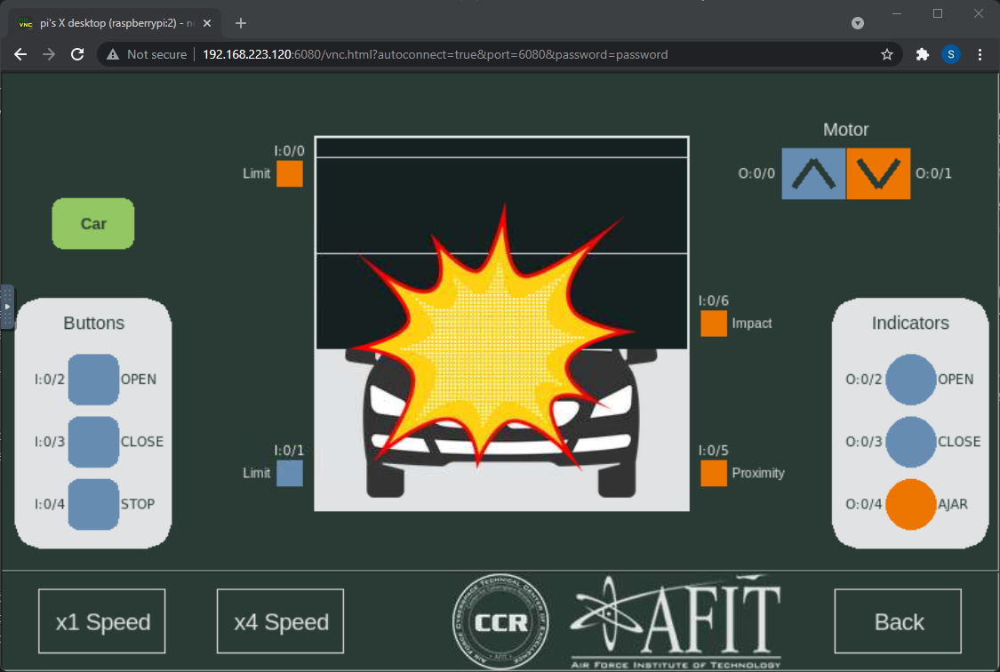

# Door simulation attack

The purpose of this exercise is for you to take what you've learned thus far and use it for evil...
You will use RSLogix to disable the safety feature that prevents the door from crashing down onto a passing care. Then you will modify the controller's code to make it automatically crash the door into a passing car. 

## Introduction

1. On the [Raspberry Pi](./02_hilics_vnc.md), open the Door simulation. 

2. Open the door by clicking the "OPEN" button (I:0/2). 

3. Once it is open, click the "Car" button and see how the Proximity sensor reacts. The car will stay there for 10 seconds before disappearing. You can click the "Car" button periodically to keep resetting the 10 second timer.

4. While the car is present, click the "CLOSE" button. Does the door go down?

## Instructions

### IMPORTANT: Save a copy of the original project file from the PLC before you begin. You will want to revert to that later.

### 1. Crash the door into the car

Your first objective is to use RSLogix to crash the door into the car. With RSLogix in Online mode, use Forces to cause the crash. Remove the Forces when you're done.

Note: This attack requires you to be actively connected to the PLC, and it requires a human to launch the attack. This is less than ideal, but is very effective.

 

### 2. Disable the safety feature

Your next objective is to figure out what prevents the door from going down while a car is present and then disable this function. Do NOT use forces, instead, modify the ladder logic. The goal is for this attack to work without you monitoring the system.

Show that you disabled it by clicking the "CLOSE" button while a car is passing and crash the door into the car. 

Note: This attack requires a specific set of circumstances to occur in the physical world. A car must be passing through and the CLOSE button must be pressed by a human. If you know that these circumstances will occur, then this attack can be quite effective. 

### 3. Automatically crash the door into the car

Your last objective is to modify the ladder logic to automatically close the door any time a car is present. Your ladder logic should work as normal, except that whenever a car is present (hint: I:0/5) the door should go down regardless of the state of any buttons or sensors.

Note: This attack is effective, except that it will crash into the first car that passes. Think through how you could modify your attack to be more subtle or to target a specific car. There are many limitations here, which makes developing sophisticated attacks difficult.

## Questions to think about: 

1. What are some ways a defender could prevent this attack using network defenses? 

2. What security functions (firewall, antivirus, etc.) would a PLC need to prevent this attack even if the adversary gained network access to the PLC?

3. How could an asset owner redesign the physical system to prevent this attack even if an adversary gained control of the PLC?

