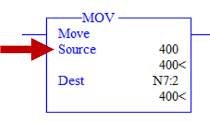
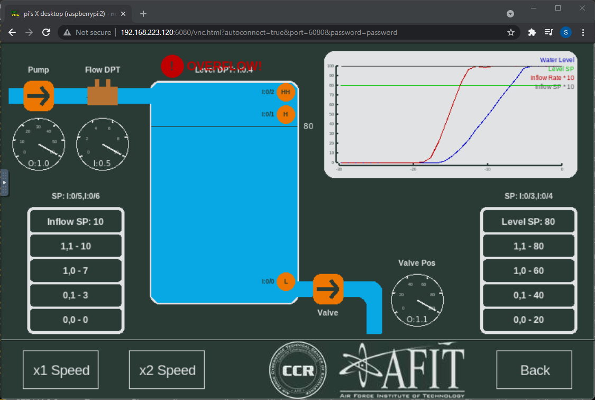
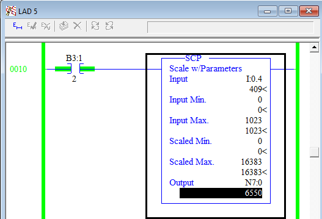
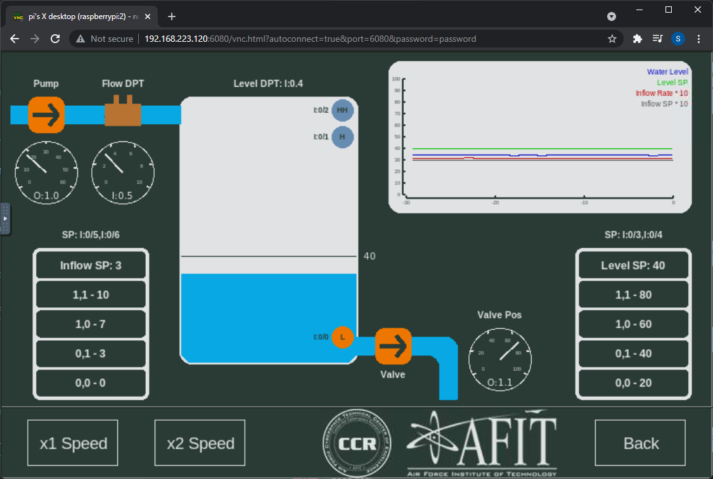

# Fluid Tank simulation attacks

The goal of this exercise is for you to use what you've learned to attack the Fluid Tank simulation. You will use RSLogix to purposely overflow the water tank. Then, you will make more subtle modifications to cause other effects.

**Note: While you can change parts of the ladder logic while Online, it's best to Go Offline, make your changes, download the new code to the PLC and go Online again.**

## Introduction

1. On the [Raspberry Pi](./02_hilics_vnc.md), open the Fluid Tank simulation. In RSLogix, open LAD 5 in [Online mode](./09_online.md).

2. Change the Level SP in the simulation and see what changes in RSLogix. Which variable in RSLogix determines the level setpoint? 

2. Change the Inflow SP in the simulation and see what changes in RSLogix. Which variable in RSLogix determines the inflow setpoint? 

## Instructions

### IMPORTANT: Save a copy of the original project file from the PLC before you begin. You will want to revert to that later.

### 1. Overflow the water tank

Your first objective is to overflow the tank. There are multiple ways you can accomplish this. One of the easiest ways is to modify the Source of a Move command for one of the fluid level setpoints. 

**Do not set the value higher than 1000, or it will cause a fault.**

 

 

### 2. Inaccurate fluid level in the tank

You have the luxury of being able to see the ground truth physical process (or at least the simulation). Operators cannot always see the physical process (e.g., a fully enclosed fuel tank in a aircraft refueling system), so they have to trust what their PLC and sensors are telling them. Most of the time, they get this information from a human machine interface (HMI), and the HMI gets the information from the network. Assuming the HMI reads the water level from the PLC using variable N7:0, can you manipulate the fluid level in the tank without the HMI seeing the difference? Note: we don't actually have an HMI, so you'll have to use your imagination. 

One way to accomplish this task is to change the scaling parameters for the Input. Recall that the analog input from the level sensor is a 10 bit integer (0-1023). The PID controller requires a 14 bit integer (0-16383) and is currently using N7:0. If the HMI is also monitoring N7:0 over the network, it will have to assume the value from the sensor was scaled correctly. 

By causing the HMI and PLC to have different scaling parameters, you can cause a difference in the process without the HMI seeing the change. This is a simple attack, but can be very difficult for an operator to detect.

**Before modifying the code, record the value of N7:0 while the fluid tank simulation is running and stable. Do not change the simulation setpoints after you record this number. With the fluid level SP at 40, my value was roughly 6550.**

This Scale w/ Parameters (SCP) command handles the scaling from the input (I:0.4) to the integer for the PID (N7:0). Try changing the Min/Max values to cause the fluid level to stay 20% lower than intended. You will need to go offline, make the change and then download the new code.

After downloading, wait for the system to stabilize again. What is the value of N7:0? Does it match your previous value? Is the process simulation responding as expected?

  

  

### 3. Pump oscillations

Your next objective is to cause the pump to constantly change speed, thus causing oscillations in the process as well as increasing wear-and-tear on the pump. 

The pump is controlled by a [Proportional Integral Derivative (PID) controller](https://en.wikipedia.org/wiki/PID_controller). PID is a mathematical control scheme that takes an input (inflow rate in our case) and a setpoint and calculates the value to send to an actuator (the pump in our case). PID controllers have three tuning parameters that, once tuned, allow them to control the process smoothly with little overshoot or ringing. You will change the tuning parameters of the pump's PID controller to purposefully cause the pump to oscillate.

* While Offline, find the PID PD9 on Rung 0015 of LAD 5. Click "Setup Screen" to access the tuning parameters. Change the values to match the values here. 

  

  

Download the project file and watch the simulation to see the result. Here is what mine looked like before and after the change.

  

  

NOTE: Although the pump is oscillating wildly (1st order effect), there is less of an impact on the water level in the tank (2nd order effect). If operators are not monitoring the pump or inflow rate, they could completely miss this change until a hardware failure occurs (think Stuxnet).

Time permitting, try changing the three highlighted tuning parameters in other ways to see what effect it has. the values I chose were intentionally extreme, but you could make more subtle changes that would be harder to detect.

