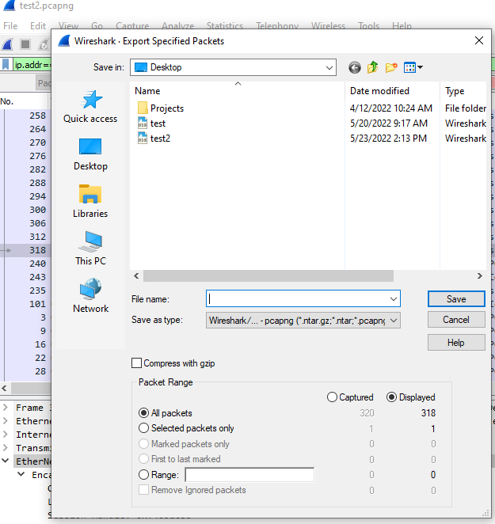
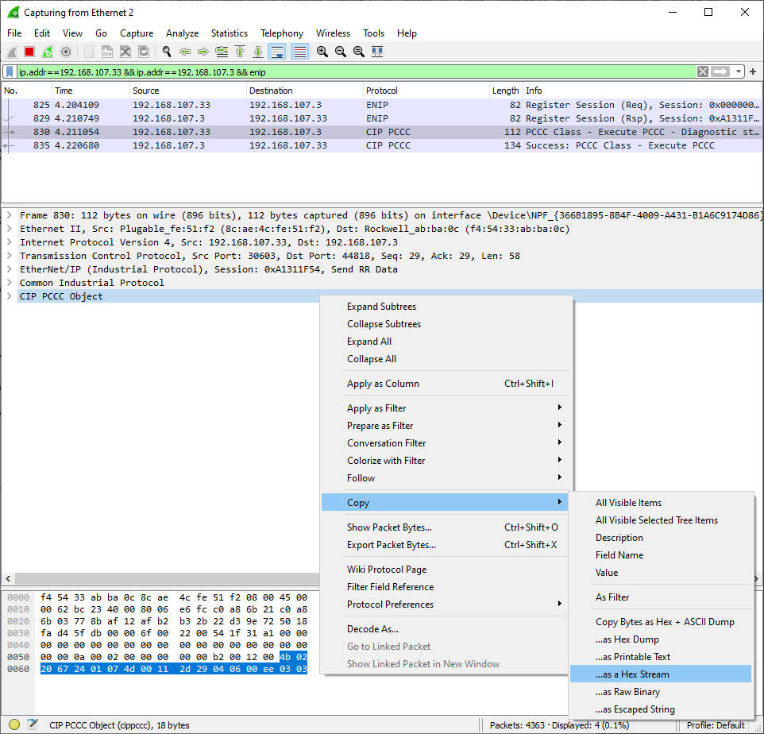

# Optional exercise: Custom exploit development

**Note: this lab should be more challenging than the previous labs. If you don't have enough time to finish, don't worry about it.**

Up until now, you have relied on RSLogix for your attacks. While this is effective, it requires a human to operate the GUI, it is difficult to automate, and is not very subtle. Did you notice how the process simulation acted while you were downloading your modified ladder logic?

One of the most difficult attacks to detect is when an adversary issues valid commands that cause a device to behave in an unsafe manner. Since the commands are not malformed or unusual, most firewalls and intrusion detection systems will miss them entirely. You will develop this type of attack. 

First, you will exercise the functionality provided by the engineering software (RSLogix) for your PLC.  Next, you will capture and analyze the network traffic between RSLogix and the PLC. Lastly, you will use Python to issue your own network commands to maliciously manipulate the PLC.


## 1. Setup

1. Make sure Python3 is installed on your RSLogix VM. It should be installed, but it might not be in the PATH.

2. Make sure Wireshark is installed on your RSLogix VM.

3. Copy CIP_ML1100_exploit.py to your VM. This script contains code that will help with the exploit development.

    * Run the following command to show the help.
        
        ```
        python3 CIP_ML1100_exploit.py -h
        ```

    * Open CIP_ML1100_exploit.py in VSCode (or other) and modify the default IP address to match your HILICS IP.
        ```
        192.168.223.[100 plus your breakout room number]
        ```
<div align="center">

</div><br/>

4.	Run the following command to test your connection. If it works, you should see '1763-LEC' in the output.
    ```
    python3 CIP_ML1100_exploit.py -t
    ```
<div align="center">

</div><br/>


## 2. Sniffing traffic

The objective in this part of the lab is to capture the packets between RSLogix and the PLC when performing specific functions. 

To accomplish this, you are going to use Wireshark to capture four specific events. Open the IO Test application on the [Raspberry Pi](./02_hilics_vnc.md). When RSLogix is [Online](./09_online.md) with the PLC:

1.	Start with the PLC in “Program” mode and switch it to “Run” mode

2.	Start with the PLC in “Run” mode and switch it to “Program” mode

3.	Force Off an Output 

4.	Force On an Output
    
**NOTE: When RSLogix is Online, it is constantly talking to the PLC, generating a significant amount of traffic. To minimize the number of packets we need to analyze, restart the Wireshark capture right before performing the action on the PLC, and then stop Wireshark immediately after.**

**It is usually best to only perform one action per Wireshark capture to help isolate the unique messages. You can do more than one action per capture, but keep track of what you did, how many times you did it and in what order.**


## 3. Analyze the network traffic

You must identify the packet(s) in Wireshark that corresponds to the actions taken in RSLogix. 

1.	Since you are looking for a packet sent from RSLogix to the PLC, configure an appropriate Wireshark display filter	

    ```
    ip.src==YOUR_IP && enip
    ```

2.	The traffic generated by being in Online Mode will repeat often, creating a lot of repetitive noise.

3.	If you only executed one command during the capture, you should see a single Request/Response pair that is unique.

4.	Your task is to find that request. One packet will not be like the others. Use your imagination to find it.
    
    **Note: ignore the "Connection Manager…" packets. They are not what you’re looking for.**

5.	Once you’ve found the correct packet, you will need to copy part of the packet into the python script.

    As shown here, right-click on “CIP PCCC Object” then select “Copy -> …as a Hex Stream”

    **Note: Your byte streams should all start with: "4b02…"**

    **Note: This is a capture of “python3 CIP_ML1100_exploit.py -t”. You might want to reproduce it and compare your hex stream to mine to make sure you know what to copy. It can be tough to troubleshoot if you copy the wrong part of the packet or grab the wrong format.**

<div align="center">

</div><br/>


## 4. Write and test your exploits


1.	Open CIP_ML1100_exploit.py in your favorite text editor or IDE.

2.	Check the default IP address to make sure it matches your PLC’s IP.

<div align="center">

</div><br/>

3.	Read through the code and comments to get a basic understanding for how everything works. I’ve provided a class and helper functions to make it easier.

4. Implement the four commands using the data you copied from Wireshark (**look for TODO: in the code**). I recommend testing them as you go.

    * options.prog and options.run: 

        For these two options, you will simply send a static command copied from Wireshark.

        ```
        python CIP_ML1100_exploit.py -P
        python CIP_ML1100_exploit.py -r
        ```

    * options.forcelow and options.forcehigh

        For these two commands, you can start by sending a static command to force a single, specific Output.

        ```
        python CIP_ML1100_exploit.py -f 0
        python CIP_ML1100_exploit.py -F 0
        ```
        
        If you have time, analyze more packets and see if you can figure out how to generalize the commands to force a desired Output based on its index or address. 

        ```
        python CIP_ML1100_exploit.py -f 1
        python CIP_ML1100_exploit.py -F 4
        ```


## Congratulations, you are done!

When you're done, please fill out [this anonymous survey](https://docs.google.com/forms/d/e/1FAIpQLSfQBPGj1IZ4i3MEplFjXIlTl6LEWxhWHdIzfahgy25niwQJKA/viewform?usp=sf_link). This is just for me to improve the content for next year, so please be honest.


