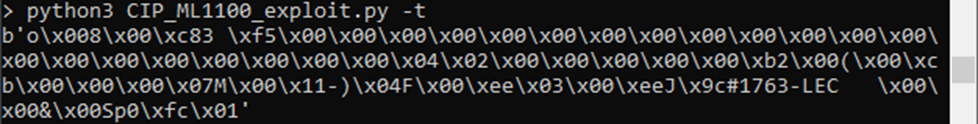

# Custom Attack Development

## Objective

Up until now, you have relied on RSLogix for your attacks. While this is effective, it: 
  
1. Requires a human to operate the GUI. 
1. Is difficult to automate.
1. Is not very subtle. 
  
Did you notice how the process simulation acted while you were downloading your modified ladder logic?

One of the most difficult attacks to detect is when an adversary issues valid commands that cause a device to behave in an unsafe manner. Since the commands are not malformed or unusual, most firewalls and intrusion detection systems will miss them entirely. You will develop this type of attack.

First, you will exercise the functionality provided by the engineering software (RSLogix). Next, you will capture and analyze the network traffic between RSLogix and the PLC. Lastly, you will use Python to issue your own network commands to duplicate the capability.

The techniques you will learn in this lab can be used in many areas, such as automating IoT devices, fuzz-testing devices, building network scanners, and developing custom exploits.


# Python Primer

You are going to write a Python script to connect to the PLC and send it a few commands. This primer should help get you started.

## Socket Programming (TCP Client)

You will need to open a TCP socket to send and receive packets. The socket will handle the TCP stuff, so you just need to worry about the Ethernet/IP, CIP, and PCCC stuff.

``` python
import socket

sock = socket.socket(socket.AF_INET, socket.SOCK_STREAM)

sock.connect(('192.168.223.199', 80)) # Note the double parentheses ((a,b)),  (a,b) is a tuple

sock.send(b'Hello World') # only works with bytes, not strings

response = sock.recv(65536) # response will by a byte object (it will have however many bytes were received - 65536 is a max)

sock.close()
```


## Strings vs Bytes

https://www.geeksforgeeks.org/byte-objects-vs-string-python/


In Python 3, strings and byte arrays are distinct. Sockets work with bytes. You can convert from one to the other, but it's generally easiest to stick with bytes.

``` python
>>> type(b'123') # Note the leading 'b'
<class 'bytes'>
>>> type('123')
<class 'str'>
```

When working with sockets, if you get the following error, it means you're passing in a string object, not a bytes object.

```
Traceback (most recent call last):
  File "<stdin>", line 1, in <module>
TypeError: a bytes-like object is required, not 'str'
```

## bytes functions

If you have a hex encoded string, you can convert that to raw bytes. Make sure your hex string has an even number of characters (two characters are needed to define a byte).

``` python
>>> bytes.fromhex('3031323334')
b'01234'
```

When you get raw data back from the socket, you may want to print it to the terminal in a format that's easier to read. You can hex-encode a byte array.

``` python
>>> response = b'1234'
>>> response.hex()
'31323334'
```

## Copying data from Wireshark

Once you find a packet in Wireshark that you want to duplicate using Python, you can copy the part of the packet you want. If you right-click on a protocol layer and copy "as a Hex Stream", you can paste it into a variable and use the `bytes.fromhex()` function to convert it to the proper format to send using the socket.

Note: The line you right-click on will determine the part of the message that gets copied.

<div align="center">

</div><br/>


## Parsing responses from socket

`sock.recv()` will return a bytes object that you will need to parse some data out of. Python's standard string splicing works here.

```python
>>> data = b'1234567890abcdefghijklmnop'

>>> data[5:15]
b'67890abcde'

>>> data[5:9]
b'6789'

>>> data[8:11].hex() # Note the length of the printed string is doubled
'393061'
```

## Packing data packets

If you have a bytes object that you want to put in a packet, Python's standard concat syntax works.

```python
>>> b'12345' + b'HELLO' + b'67890'
b'12345HELLO67890'
```

If you need to pack an integer value (e.g., a calculated length field), you can use the `struct` library.


```python
>>> struct.pack('<H', 0x1207) # Two-byte (unsigned) little-endian
b'\x07\x12'

>>> struct.pack('>H', 0x1207) # Two-byte (unsigned) big-endian
b'\x12\x07'

>>> struct.pack('<I', 0x1207) # Four-byte (unsigned) little-endian
b'\x07\x12\x00\x00'

>>> data = b'efgh'
>>> b'abcd' + struct.pack('<H', len(data)) + data  # I use this often
b'abcd\x04\x00efgh'


```

You can find more details here:
https://docs.python.org/3/library/struct.html


# RSLinx vs RSLogix


You haven't done much with it, but RSLinx is actually the application that handles all communication with your PLC. RSLogix tells RSLinx to send commands and such, but RSLinx handles the actual communication. This is why you configure the IP address of the PLC in RSLinx and not directly in RSLogix (unless you want to reconfigure the PLC).


# Terminology

For the purpose of this lab, I will use the following terminology:

* Client - your PC
* Server - the PLC
* Request - packet from client requesting information
* Command - synonymous with request (in this case)
* Response - packet from server in response to the client request


# Instructions

## Request 1: Register Session

Before you can send requests, you have to register an Ethernet/IP session with the PLC. To figure out how to do this, you'll need to use Wireshark to capture the **beginning of a connection** between RSLinx (or RSLogix) and the PLC. If you don't see the TCP SYN-SYNACK-ACK sequence, you probably missed the beginning (or you're filtering out TCP packets). 

**To save time, I have provided a capture of the beginning of an Ethernet/IP session (`ENIP_Initial_Connection.pcapng`). Use this to register a session using your own Python.**

Write a Python script to duplicate the register session request. Your script should:

1. Create a TCP socket and connect to **your** PLC's IP address and TCP port number.
1. Send the "Register Session" command to the PLC.
1. Receive the response.
1. Parse the returned Session Handle into a variable (you'll need it for all subsequent commands).
1. Print the Session Handle to the terminal in human-readable hex format (bytes.hex() function may be useful).

Run your script and capture the exchange with Wireshark. Compare your printed session handle with the session handle reported by Wireshark to verify you parsed out the correct value. 

If you get errors, compare the Wireshark capture from your script to `ENIP_Initial_Connection.pcapng` to identify the error. Wireshark may also tell you if your request is malformed.

Note: If you convert the session handle to an integer, make a note of the endianness so you can put it into subsequent requests correctly. It's easier to just leave it as a bytes object.


### Fun side note

Rockwell clearly doesn't know how to close a TCP connection. This is most likely due to the fact that they never actually close connections. I've looked at three tiers of Rockwell PLCs (MicroLogix, CompactLogix and ControlLogix) and they all do it differently and incorrectly. **The reset packet is their fault, not yours.**


## Request 2: Request the Identity of the PLC

When scanning an unknown device, obtaining the model number and firmware version of the device is very wise. 

In `ENIP_Initial_Connection.pcapng`, look for a **response** packet containing the string, "```1763-L16BWA B/16.00```". This is the model number and firmware version of your PLC. Your model or firmware version may be slightly different. 

Once you find the response from the PLC, you need to identify the corresponding request. Many times, this will be the request directly preceding the response; however, RSLinx may use more than one TCP connection or can interweave requests (i.e., send multiple requests before getting any responses).

Add this request to your script. I recommend writing a Python function/subroutine for each type of request. Your script should now:

1. Connect to the PLC
1. Register a session and parse the response
1. Request the PLC's identity using the correct session handle.
1. Print the response to the terminal to verify the information 

	Note: do not use `hex()` to print the response or you won't see the model string. Print the raw packet. You'll get some garbage, but the model will be mixed in (it's already in ASCII)

Use Wireshark to double-check your script.


## Request 3: Force an output

Here's where things get interesting. You now know enough to duplicate pretty much any command RSLogix sends. You've used Forces before, so let's write a script to Force the garage door motor to go down.

1. Open RSLogix and download a project file to the PLC.
1. Go Online with the PLC.
1. Start Wireshark.
1. Force an Output On.
1. Stop Wireshark.

When Online, RSLogix is sending a lot of traffic to/from the PLC. If you're quick you can limit the amount of traffic Wireshark sees to a few seconds. Even then, you'll probably get hundreds of packets. 

### Finding the request: 
You're searching for a needle in a haystack. There are lots of ways to find the desired request. Here are some examples in no particular order:

* Look at every packet and see if the Wireshark protocol dissectors or packet details give you a clue.
* Sort the list of packets by different columns and look for the unique packet.
* Use Wireshark's "Find packet" function to search for some known value.


Once you find it, add this request to your Python script. Verify it using Wireshark and RSLogix.


## Request 4: Write an Integer

In RSLogix, while Online, open the N7 file on the left. Choose an integer that is not written by the Ladder Logic, and change the value. In Wireshark, find the packet that allows you to write values to the integer file. Add this command to your script and make the specific value that gets written customizable. 


## Request 5: Read an Integer

Up until now, most of the requests you found were only sent by RSLogix when you initiated it. This request will be harder to find and may require a different technique. 

Open the N7 file on the left. While Online, RSLogix is constantly reading the state of all the data file elements. You should be able to find the request type that reads a specific integer element from the N7 file. Add this command to your script. 


